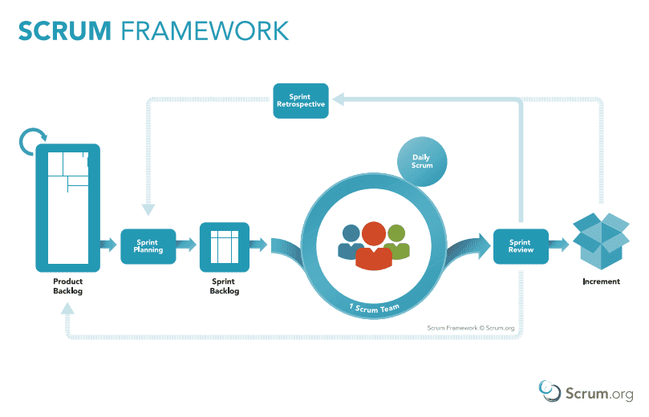
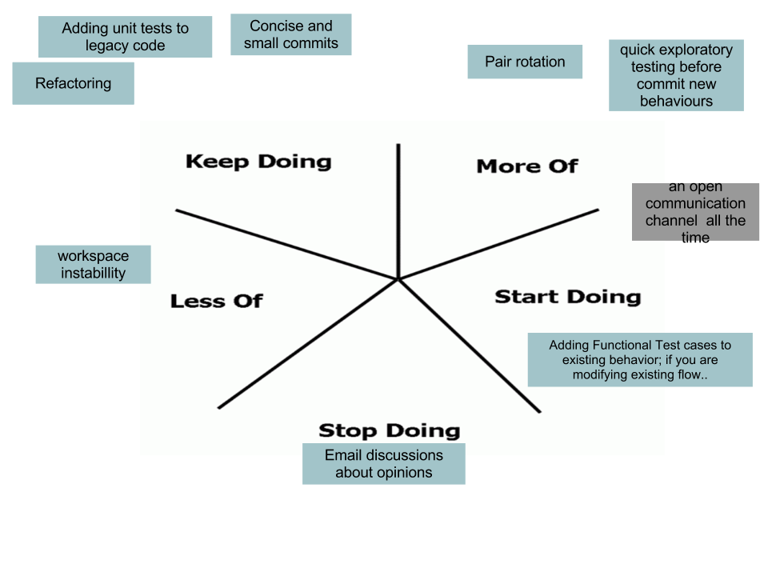

# Answers for interview prep

**Agile**
1. What are the 3 amigos?
    - The 3 amigos refers to which perspectives a team should focus on when examining an increment of work, before, during and after development.
    - They are the BA (Business Analyst) and/or PO (Product Owner), the Developer, and the Tester.
2. What are personas?
    - These refer to detailed fictitious product users crafted by the team.
    - Used to give the team an anchor for justifying certain design choices and features.
3. What are information radiators, with examples?
    - It is a comprehensive display of key team information to be shared openly with all team members and stakeholders. It is to be continuously updated.
    - It's general term for handwritten, designed, printed or electornic displays in a highly visible location.
    - Examples are: Trello, Burndown charts, planning boards, story boards
4. What are the Agile values?
    - It refers to the four values in the Agile manifesto.
    1. Individuals and interactions over processes and tools
    2. Working software over comprehensive documentation
    3. Customer collaboration over contract negotiation
    4. Responding to changes over following a plan
5. What are Agile principles?
    - Refers to the 12 principles as laid out in the Agile manifesto.
    1. Highest priority is to satisfy the customer through early and continuous delivery of software
    2. Welcome chaning requirements, regardless of how far in development one is.
    3. Deliver working software frequently.
    4. Business people and developers must work together daily throughout the project.
    5. Build projects around motivated individuals. Give them the environment and support they need, and trust them to get the job done.
    6. The most efficient and effective method of conveying information to and within a development team is face-to-face conversation.
    7. Working software is the primary measure of progress.
    8. Agile processes promote sustainable development. The sponsors, developers, and users should be able to maintain a constant pace indefinitely.
    9. Continuous attention to technical excellence and good design enhances agility.
    10. Simplicity–the art of maximizing the amount of work not done–is essential.
    11. The best architectures, requirements, and designs emerge from self-organizing teams.
    12. At regular intervals, the team reflects on how to become more effective, then tunes and adjusts its behavior accordingly.

**Scrum**
- What are Scrum artifacts?
    - Refers to three concepts: the product backlog, the sprint backlog and the potentially releasable product increment.
- What are scrum events?
    - Refers to the following events: sprint planning, a daily scrum, a sprint review and a sprint retrospective.
- What is a sprint?
    - A sprint is a time-boxed period where teams will aim to provide a "Done", useable, potentially releasable product increment. 
    - It's used to help keep teams motivated and focused by breaking up product development into smaller, more manageable pieces that focuses on only a small number of features.
- What are the scrum roles?
    - Refers to the Product Owner, the Scrum Master and the Scrum Team.



- What is a starfish retrospective?
    - It is a retrospective focused on 5 areas: "keep doing", "less of", "more of", "stop doing", and "start doing".

    

**Potential questions**
- What is Agile?
    - Agile is a software development methodology focused on incremental production. By splitting up product development into smaller, more manageable chunks, it allows the development team to continuously deliver and amend working software. It's biggest strength is really how fast it allows a team to respond to changing circumstances and new design ideas from customers.

- What is Scrum?
    - Scrum is an Agile framework that aims to help teams deliver and change products consistently and effectively. It applies Agile's "incremental" values through time-boxed periods of development called "sprints". These last for at most a month and within them they have several events that help push production and keep the team engaged. The sprint planning helps give the team a goal to work towards at the start of the period while daily scrums foster teamwork and help team members highlight difficulties with production. A sprint review focuses on the product increments and aims to adapt the product backlog relative to what was achieved during the sprint. The product increment is shown to the stakeholders and feedback would be given. This will all be considered when changing the product backlog. Finally there is the sprint retrospective for the scrum team. This is where they plan and inspect potential improvements in the next sprint.

- What's the difference between Scrum and Agile?
    - While Agile is a methodology composed of principles and values that focus on incremental change, Scrum is a framework that helps apply Agile values in a team setting. A company can implement Agile methodologies via Scrum. Both work hand-in-hand to help continuosly deliver working software while being able to adapt to changing circumstances.

- What is the waterfall model?
    - It is a software development process that emphasises a logical progression of steps be taken.
    1. The first step involves preparing a list of requirements to serve as the basis for all future development.
    2. Afterwards, the requirements list is analysed and a design for the product is created, helping to define the overall system architecture.
    3. The system is now developed in small programs called units. Each unit is developed and tested in phases called "Unit Testing".
    4. After testing of units, each one is integrated into the system and the entire system itself will be tested for faults/failures.
    5. Once functional and non-functional testing is finished, it will be deployed in the customer environment or deployed into market.
    6. When issues crop up, patches are released to to fix them. This is known as maintenance.
    
    

 - What is the V-model?
    - A software development model that extends beyond the waterfall model and incorporates testing phases for each development stage. This means for every phase of development, there is a corresponding testing phase.
    - You can see in the image, the arrows on the outer layers follow the waterfall model.

    

- Differences between Agile and V-Model/Waterfall.
    - The main differences lie within how these developmental models approach development and testing phases. Agile places a lot of emphasis on concurrent testing and development whereas the v-model and waterfall don't. Since the waterfall model is linear and forces teams to follow a pre-defined structure, it is not as flexible as Agile. Due to the incremental nature of Agile, software requirements constantly evolve depending on feedback which contrasts to the waterfall and v-model which does not provide much scope in changing requirements once development has started. There is also very little interaction between developers and other team members in the waterfall model compared to Agile.

    - The waterfall model is preferable to Agile when working with small projects. It can also be better if there is no expert that can make important decisions regarding software changes. However, for larger projects (like those within established companies and perhaps even startups), the Agile model is just far more versatile and responsive than waterfall and v-model. If factoring in cost, it is cheaper to apply a waterfall model for development than Agile due to waterfall being a very easy model to both structure and manage.

**SQL**
- A foreign key is a key that is used to link two tables together by referring to a primary key in another table.

- SQL commands can be categorised into four categories: DDL, DML, DCL and DQL.
    1. DDL = "Data definition language" -- this refers to all syntax used to define a database's structure. Used to create and modify objects within a database. Examples are ```CREATE```, ```DROP``` AND ```ALTER```.
    2. DML = "Data manipulation language" -- refers to all syntax that manipulates data such as ```INSERT```, ```UPDATE``` and ```DELETE```.
    3. DCL = "Data control language" - refers syntax dealing with rights and permissions within the database. Examples are ```GRANT``` and ```REVOKE```.
    4. DQL = "Data query language" -- refers to querying language used to return data found in the database. The main one is `SELECT`.

**Python**
- OOP stands for "Object oriented programming". It's a paradigm based on programming and organising design around data called "objects" rather than functions and logic. Such "objects" have unique attrivutes and behaviours associated with them, not necessarily distinct from others. The four pillars of OOP are: Encapsulation, Polymorphism, Inheritance and Abstraction. They keep work organised, modular and maintainable.
    - **Encapsulation** refers to keeping the inner workings of an object hidden. Keeping code and methods safe within a class helps maintain integriy and security of software.
    - **Abstraction** is a natural progression to encapsulation. An analogy is: "one doesn't need to know how a car works for one to drive it". By simplifying the underlying code within, we are only showed the essential tools to use it and hence provide other users with greater usability through reducing complexity.
    - **Inheritance** provides objects with greater usability by allowing them to access features from other objects. It makes code reusable and helps with implementing DRY
    - **Polymorphism** refers to how functions and methods that are named the same can do vastly different things. This is due to the fact that parent methods or attributes can be changed to suit the specific class.

- TDD = "Test driven development". Test cases are developed to specify and validate what code will do. For each functionality in a product, a test case is created first to ensure it works as specified. New code should only be written if an automated test has failed. This helps with writing code that is neither repetitive nor over-engineered.

**STAR Examples**
- Example when you implemented OOP
    - There was a task involving the creation of a bank account and ways to manage it. So to complete the task using OOP I created a base class consisting of a customer's name, address and age. Then within a sub-class called "MyAccount", I initialised their bank account by assigning them an account number, a balance and a specific bank fee number. Within this sub-class, I created methods to deposit and withdraw money (hence changing the total balance attribute) as well as giving them the option to view their balance. Finally, I created a sub-class of this called "ManageAccount" that acted like an ATM machine. This class had a terminal menu that acted like a real ATM machine -- there were options to choose from like checking balance and withdrawing and depositing money. The latter two methods being inherited from the "MyAccount" class. So in the end I managed to create a functioning ATM machine that took information from a pseudo bank account.

**DevOps**
- What is it?
    - It is a methodology that combines development and IT operations into a single unit. Traditionally, these two teams were separate from one another and DevOps merges them to create a single team responsible for the entire lifecycle of a product.

- Why choose DevOps?
    - DevOps has many advantages to the traditional models of development. Applying this model allows for much faster development alongside easier maintenance of existing deployments. Applying CI/CD to your projects allows for more efficient managing of products, as the entire process is largely automated.

- Why did you choose DevOps?
    - My interest in technology and future innovations led me to pursue a career in this field. As someone who understands the importance of efficient and reliable delivery of service, I resonated with the core philosphy of DevOps and felt that it was a perfect path to take. 

---
**Used:**
- [3 Amigos](https://www.agilealliance.org/glossary/three-amigos/)
- [Personas](https://www.agilealliance.org/glossary/personas/)
- [Information radiators](https://blog.teammood.com/information-radiator)
- [Agile values](https://www.projectmanager.com/wp-content/uploads/2019/07/the_agile_manifesto-600x780-v2-1-600x867.jpg)
- [Agile Principles](https://www.agilealliance.org/agile101/12-principles-behind-the-agile-manifesto/)
- [Scrum artifacts](https://www.scrumalliance.org/about-scrum/artifacts#:~:text=Scrum%20defines%20three%20artifacts%3A%20Product,a%20potentially%20releasable%20product%20increment.)
- [Scrum-related](https://www.scrumalliance.org/)
- [Waterfall](https://www.tutorialspoint.com/sdlc/sdlc_waterfall_model.htm)
- [OOP](https://medium.com/@benjaminpjacobs/the-four-principle-of-object-oriented-programming-f78600f62608)
- []()

